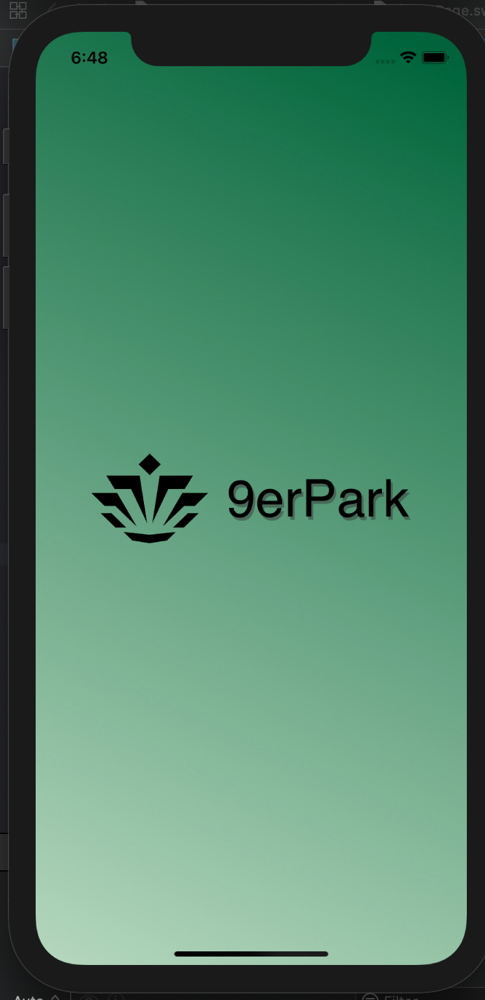
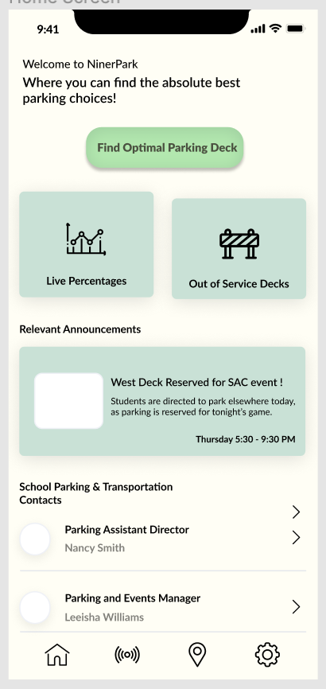
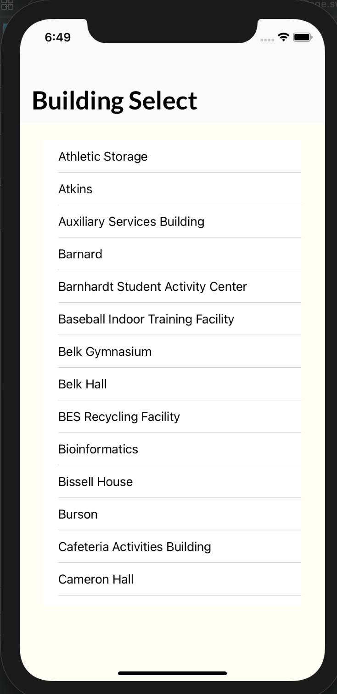
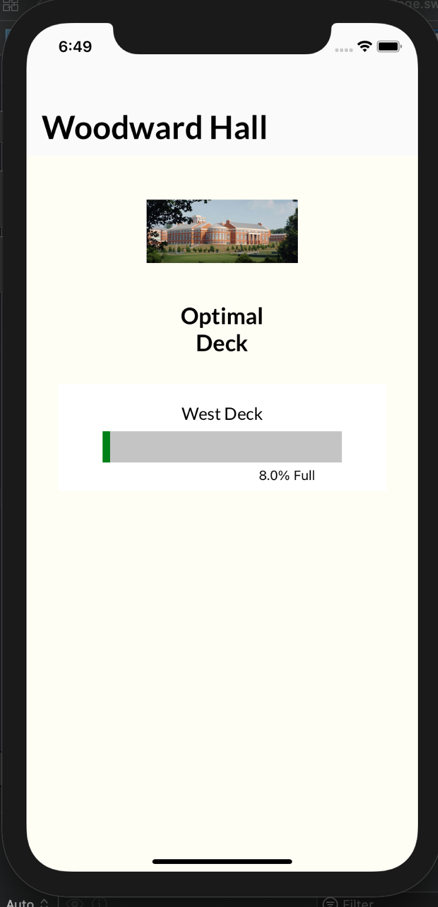
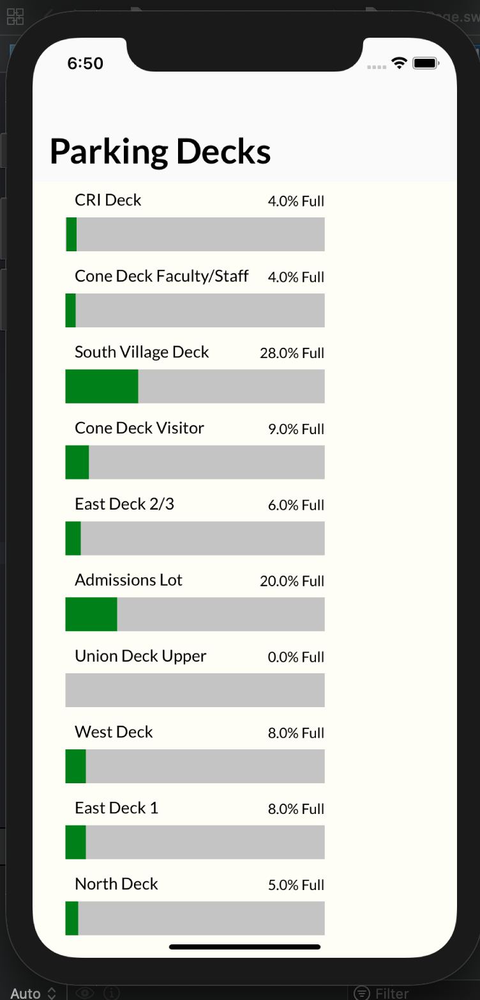

# 9erPark

## Purpose
According to a survey conducted on UNCC students in 2016, over half of the student body has expressed frustration with parking on campus. We recognized that issue and decided to take the initiative by providing commuters with an app that directs them to the optimal deck using distance to their classes and current parking availability. We hope to alleviate traffic on campus, as well as reduce the time in which students spend searching for places to park. With 9erPark, students will never have to waste time finding parking again.

Reference to the survey: 
https://assessment.uncc.edu/data-visualizations-and-survey-reports/senior-survey/parking-and-transportation

## Overview of the Main Features
9erPark is an iOS application that allows students at UNC Charlotte to:
* Select their building of choice and be directed to the best parking deck at that current time
* View live parking stats on campus
* View parking deck availability

## Images of the Application

* Launch Page

* Home Page

* Building Select

* Optimal Deck Page

* Parking Percentages Page

## Steps Involved
* Contact UNC Charlotte PaTS to get permission and access to their parking data (Completed)
* Solve CORS policy error by writing our own Middleware server to access school parking data (Completed)
* Create both high and low fidelity prototypes (Completed)
     * Balsamiq for Low-Fi Prototype (Completed)
     * Figma for Hi-Fi Protoype (Completed)
* Translate Hi-Fi design into Xcode Storyboards through the use of AutoLayout and Stack Views (In Progress)
* Write the application using Xcode and the Swift programming language to access and display the data in our app (to be completed)

## Future Plans
* Get directions to parking decks
* Display alternative parking decks to users (runner-up options to the optimal deck)
* Update students with relevant parking announcments on campus
